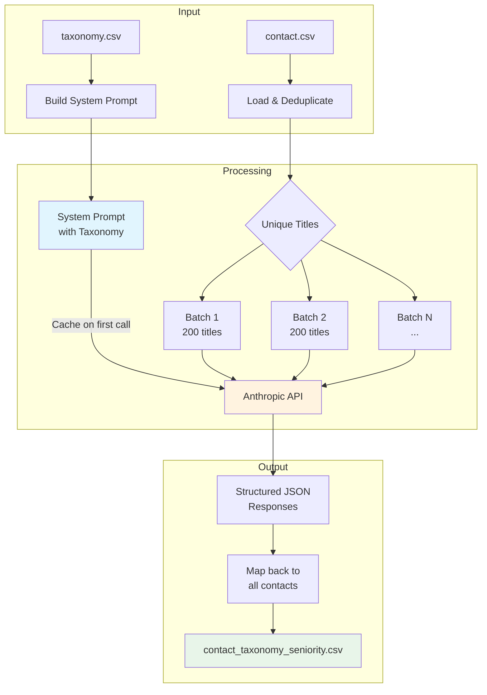
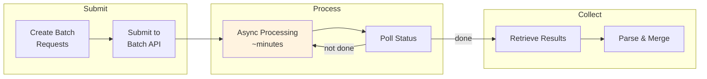

# Job Title Mapping - Keboola Component

Keboola component that maps raw job titles to a standardized taxonomy using Claude AI.

## Overview

Given input like:
- "Senior Vice President, Commercial Sales"
- "BI Engineer"
- "CEO & Co-Founder"

The component maps them to standardized titles:
- "vice president of sales" (seniority: 7, department: Executive C-Level)
- "analytics engineer (level II)" (seniority: 3, department: Data & Analytics)
- "co-founder" (seniority: 7, department: Executive C-Level)

## Features

- **LLM-powered mapping** - Uses Claude's semantic understanding for accurate matching
- **Structured outputs** - Guarantees valid JSON responses (beta feature for supported models)
- **Prompt caching** - Caches taxonomy in system prompt for 90% input token savings
- **Batch processing** - Processes multiple titles per API call for efficiency
- **Configurable** - Model, batch size, and features configurable via component parameters

## Configuration

### Parameters

| Parameter | Required | Default | Description |
|-----------|----------|---------|-------------|
| `#ANTHROPIC_API_KEY` | Yes | - | Anthropic API key (encrypted) |
| `model` | No | `claude-sonnet-4-5` | Claude model to use |
| `batch_size` | No | `200` | Titles processed per API call |
| `use_structured_output` | No | `true` | Use structured outputs beta feature |
| `use_batch_api` | No | `false` | Use Message Batches API (async, 50% cheaper) |
| `max_requests_per_batch_job` | No | `3` | Requests per batch job (only for Batch API) |
| `limit` | No | `1000` | Max records to process (0 = unlimited) |

### Supported Models

| Model | Structured Outputs | Pricing (per MTok) | Notes |
|-------|-------------------|-------------------|-------|
| `claude-sonnet-4-5` | ✅ Yes | $3 in / $15 out | **Recommended** - best balance of speed & quality |
| `claude-opus-4-1` | ✅ Yes | $15 in / $75 out | Best quality, slower, more expensive |
| `claude-haiku-4-5` | ❌ No | $1 in / $5 out | Fastest, cheapest |
| `claude-opus-4-5` | ❌ No | $5 in / $25 out | Premium quality, moderate speed |
| `claude-haiku-3-5` | ❌ No | $0.80 in / $4 out | Legacy - fastest, very cheap |

> **Note:** Structured outputs are currently in beta and only available for **Claude Sonnet 4.5** and **Claude Opus 4.1**. If you use a different model, you must set `use_structured_output` to `false` in parameters, otherwise the API call will fail.

### Example Configurations

**Small batches (up to ~500 records) — Real-time processing:**

```json
{
  "#ANTHROPIC_API_KEY": "sk-ant-...",
  "model": "claude-sonnet-4-5",
  "batch_size": 50,
  "use_structured_output": true,
  "use_batch_api": false,
  "limit": 0
}
```

- Fast, synchronous processing
- Results in seconds to minutes
- Best for testing, small datasets, or real-time needs

**Large batches (1,000+ records) — Batch API processing:**

```json
{
  "#ANTHROPIC_API_KEY": "sk-ant-...",
  "model": "claude-sonnet-4-5",
  "batch_size": 200,
  "use_structured_output": true,
  "use_batch_api": true,
  "max_requests_per_batch_job": 10,
  "limit": 0
}
```

- **50% cheaper** than real-time API
- Asynchronous processing (minutes to hours depending on volume)
- Best for bulk processing (10k+ records)
- `max_requests_per_batch_job`: how many API requests per batch job (parallelization)

## Input Tables

### contact.csv (required)

| Column | Type | Description |
|--------|------|-------------|
| `contact_id` | string | Unique identifier |
| `job_title` | string | Raw job title to map |
| `email` | string | Contact email |
| `contact_type` | string | Lead/Contact type |

### standardized_job_titles.csv (required)

| Column | Type | Description |
|--------|------|-------------|
| `standardized_job_title` | string | Canonical job title |
| `seniority` | number | Seniority level (1-7) |
| `department` | string | Department category |

## Output Table

### contact_taxonomy_seniority.csv

| Column | Type | Description |
|--------|------|-------------|
| `contact_id` | string | Original contact ID |
| `job_title` | string | Original job title |
| `email` | string | Contact email |
| `contact_type` | string | Lead/Contact type |
| `standardized_job_title` | string | Mapped standardized title |
| `department` | string | Department from taxonomy |
| `seniority` | number | Seniority score (-1 if no match) |

## How It Works

1. Loads contacts and taxonomy from input tables
2. Deduplicates job titles (processes only unique titles)
3. Creates system prompt with taxonomy (cached after first call)
4. Batches job titles (default: 200 per batch)
5. Sends each batch to Claude - taxonomy is cached, only titles are sent fresh
6. Claude returns structured JSON with best-match mappings
7. Results are mapped back to all contacts and written to output table

### Processing Flow



### Batch API Mode (Optional)

When `use_batch_api: true`, the component uses Anthropic's Message Batches API for 50% cost savings:



## Cost Estimation

With default settings (Sonnet 4.5, batch size 200, prompt caching enabled):
- First batch: ~$0.02 (cache creation)
- Subsequent batches: ~$0.005 (90% savings from cache hits)
- **~$8-12 per 143,000 titles** (vs ~$57 without caching)

## Local Development

```bash
# Create virtual environment
python -m venv .venv
source .venv/bin/activate

# Install dependencies
pip install -r requirements.txt

# Run locally (requires Keboola data folder structure)
python main.py
```

## Repository Structure

```
├── main.py                 # Component entry point
├── requirements.txt        # Python dependencies
├── data/                   # Local test data
│   ├── contact.csv
│   └── standardized_job_titles.csv
└── README.md
```
